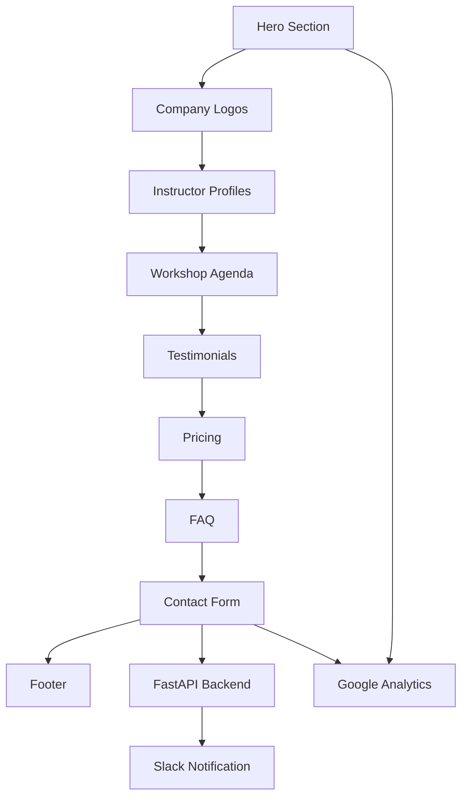

# design.md – Template

## Overview
Create a modern, professional landing page for the Vibe Coding Workshop using the existing React/TypeScript stack. The solution leverages the current FastAPI backend for contact form handling and implements a single-page application with smooth scrolling navigation between sections. The design emphasizes clarity, credibility, and conversion optimization while maintaining the minimalistic aesthetic with strategic use of vibrant colors.

## Architecture / Approach
- **Single Page Application (SPA)**: All content on one scrollable page with anchor navigation
- **Component-Based Architecture**: Reusable React components following existing project patterns
- **Mobile-First Responsive Design**: TailwindCSS utility classes ensuring optimal mobile experience
- **Progressive Enhancement**: Core functionality works without JavaScript, enhanced with React interactions
- **Backend Integration**: Existing FastAPI contact service handles form submissions with rate limiting
- **Analytics Integration**: Google Analytics 4 for tracking visitor behavior and form conversions

### Key Components Structure:
```
/components/landing/
├── HeroSection.tsx          # Main value proposition and CTA
├── CompanyLogos.tsx         # Carousel/grid of client companies  
├── InstructorProfiles.tsx   # Christian & Kasper bios
├── WorkshopAgenda.tsx       # Day 1 & Day 2 curriculum
├── TestimonialsSection.tsx  # Social proof (placeholders initially)
├── PricingSection.tsx       # Three-tier pricing display
├── FAQSection.tsx           # Common questions and answers
├── ContactForm.tsx          # Lead capture form
└── Layout/
    ├── Navigation.tsx       # Sticky nav with scroll-to-section
    └── Footer.tsx           # Contact info and social links
```

### Flow Architecture:


## Technology Choices
- **Frontend Framework**: React 19 with TypeScript (existing stack)
- **Styling**: TailwindCSS v4 with custom color utilities for vibrant accents
- **UI Components**: Radix UI primitives for accessible interactions (carousel, forms)
- **Form Handling**: React Hook Form for validation and submission
- **Routing**: React Router DOM v7 for potential future multi-page expansion
- **State Management**: Zustand for any global state (theme, form state persistence)
- **Build Tool**: Vite for fast development and optimized builds
- **Icons**: Lucide React for consistent iconography

### Backend Integration:
- **API Endpoint**: Existing `/api/contact` with ContactFormRequest schema
- **Rate Limiting**: Leverages existing SlowAPI rate limiting
- **Form Fields**: name, company (optional), email, inquiry_type (default: "workshop"), message
- **Response Handling**: ContactFormResponse with success/error messaging in Danish

### Analytics Implementation:
- **Google Analytics 4**: Track page views, scroll depth, form interactions
- **Custom Events**: 
  - `form_start` - User begins filling contact form
  - `form_submit` - Successful form submission
  - `section_view` - User scrolls to different page sections
  - `cta_click` - Clicks on pricing CTAs or contact buttons

## Testing Strategy
- **Unit Tests**: Jest/React Testing Library for component logic
  - Contact form validation and submission
  - Company logos carousel functionality
  - Responsive breakpoint behavior
- **Integration Tests**: End-to-end form submission with backend
  - Contact form successfully submits to `/api/contact`
  - Form validation prevents invalid submissions
  - Success/error states display correctly
- **Visual Regression Tests**: Screenshot comparison for consistent design
- **Accessibility Tests**: axe-core integration for WCAG compliance
- **Performance Tests**: Lighthouse CI for Core Web Vitals monitoring
- **Cross-Browser Testing**: Chrome, Firefox, Safari on desktop and mobile

### Testing Data Requirements:
- Mock company logos for development/testing
- Placeholder testimonials with proper schema
- Test contact form submissions that don't trigger real notifications
- Analytics testing with debug mode enabled